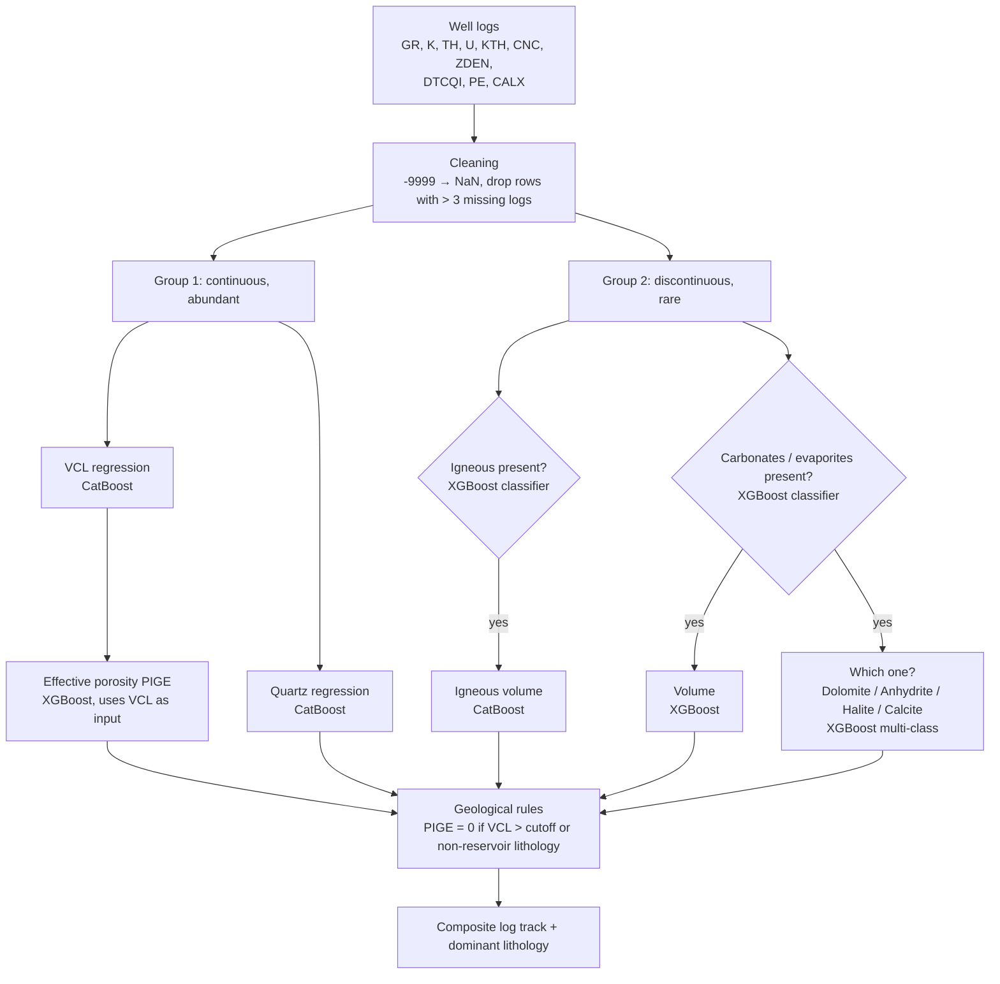

# LithoVision Pro

**Automated lithology and petrophysical interpretation from well logs using gradient boosting.**

LithoVision Pro predicts mineral volume fractions (clay, quartz, igneous rocks, carbonates and evaporites) and effective porosity along a well, from standard open-hole logs. It reproduces the output of a deterministic multimineral interpretation (Quanti.Elan in Techlog) in a few minutes per well instead of several hours, without a proprietary software license.

🔗 **Live demo:** [lithologyapp.streamlit.app](https://lithologyapp-ssqr7aan3tojp5gug8ka4m.streamlit.app/)

> Final-year engineering project (Mining Engineering, École Nationale Polytechnique d'Alger, 2025), carried out in partnership with SONATRACH on wells from the Touggourt region (Algeria).

---

## The problem

Petrophysical interpretation of a well is slow, expert-dependent and tied to licensed software. The target lithologies are also **strongly imbalanced**: clay is present in 99 % of samples, while halite appears in only 1.5 %. A single classifier or regressor handles the rare facies poorly.

## Approach: a hybrid classification–regression pipeline

Targets are split by how often they occur, and each group gets its own strategy:



- **Group 1 – continuous targets (VCL, Quartz, PIGE):** direct regression.
- **Group 2 – sporadic targets:** a *hurdle* approach. A classifier first detects whether the lithology is present; a regressor then estimates its volume only where it is detected. For carbonates and evaporites, a final multi-class model identifies the specific mineral.
- **Missing values:** tool failures (`-9999`) are kept as missing values and handled natively by XGBoost and CatBoost, instead of being imputed. Only depth samples where almost all logs are missing were discarded during training (≈ 1 % of the data).
- **Feature selection:** resistivity logs were excluded. They respond mainly to fluid saturation, not to lithology (correlation with targets < 0.09).
- **Tuning:** Bayesian search with Optuna, then manual refinement to keep the train–validation R² gap under 2 %.

## Data

| | |
|---|---|
| Wells | 10 (9 for training / validation / test, 1 held-out well for blind validation) |
| Samples | 21,724 depth samples (~3,200 m of logged interval) |
| Input logs | GR, KTH, K, TH, U (spectral gamma ray), CNC (neutron porosity), ZDEN (bulk density), DTCQI (compressional sonic), PE (photoelectric factor), CALX (caliper) |
| Targets | Volume fractions from a Quanti.Elan reference interpretation |

The well data is proprietary (SONATRACH) and is **not included** in this repository.

## Results

**Test set**

| Target | Model | Metric | Score |
|---|---|---|---|
| Clay volume (VCL) | CatBoost | R² | **0.983** (MAE 0.026 v/v) |
| Quartz | CatBoost | R² | **0.906** |
| Effective porosity (PIGE) | XGBoost | R² | **0.855** (MAE 0.009 v/v) |
| Igneous – detection | XGBoost | Accuracy / F1 | **97 % / 0.95** |
| Igneous – volume | CatBoost | R² | **0.939** |
| Carbonates & evaporites – detection | XGBoost | Accuracy / F1 | **93 % / 0.91** |
| Carbonates & evaporites – volume | XGBoost | R² | **0.814** |
| Dolomite / Anhydrite / Halite / Calcite | XGBoost | Accuracy / F1 | **97 % / 0.91–0.98** |

**Blind well (never seen during training)**

| Target | R² |
|---|---|
| VCL | 0.901 |
| PIGE | 0.720 |

The drop on the blind well is expected, since logs vary between wells. VCL stays reliable; porosity is suited to a qualitative screening of reservoir intervals (none / low / high porosity).

## Running the app

```bash
git clone https://github.com/Bilal-bngtf/lithology_app.git
cd lithology_app
pip install -r requirements.txt
streamlit run app.py
```

Then upload a `.csv` or `.xlsx` file in the sidebar and click **Lancer la prédiction**.

### Input format

The file must contain these columns, with **exactly these names** (see [`data/input_template.csv`](data/input_template.csv)):

```
DEPTH, CALX, CNC, DTCQI, GR, K, KTH, M2R1, M2R2, M2R3, M2R6, M2R9, TH, U, PE, ZDEN
```

| Column | Log | Unit |
|---|---|---|
| DEPTH | Measured depth | m |
| CALX | Caliper | in |
| CNC | Neutron porosity | v/v |
| DTCQI | Compressional sonic | µs/ft |
| GR | Gamma ray | gAPI |
| K / TH / U | Potassium / Thorium / Uranium (spectral GR) | % / ppm / ppm |
| KTH | Gamma ray without uranium | gAPI |
| M2R1 … M2R9 | Array induction resistivities | Ω·m |
| PE | Photoelectric factor | b/e |
| ZDEN | Bulk density | g/cm³ |

Missing values can be coded as `-9999` or left empty. The app drops depth samples with more than 3 missing logs and passes the remaining gaps to the models as missing values. Resistivity columns are required by the input format but not used by the models.

### Output

- A composite log display: VSH, Quartz + PIGE, Igneous, carbonates/evaporites, and the dominant lithology column.
- Summary statistics, and a CSV download of all predictions.
- The **VSH cut-off** slider sets the clay volume above which effective porosity is forced to zero.

## Repository structure

```
├── app.py                    # Streamlit app: cleaning, prediction pipeline, plots
├── requirements.txt
├── data/
│   └── input_template.csv    # expected column names
└── src/models/trained/
    ├── Regression/           # VCL, Quartz, PIGE, Igneous, other-lithology volume models
    └── Classification/       # presence classifiers + final multi-class model
```

## Limitations and next steps

- Trained on a single basin (Triassic clastic reservoirs, Algeria); applying it elsewhere requires retraining.
- Porosity generalizes less well than clay volume across wells.
- Planned: water saturation (Sw) prediction, LAS file input, and uncertainty estimates on each prediction.

## Author

**Bilal Gholameddine Benguettaf** — Mining Engineer & Digital Geoscientist
bbenguettaf@gmail.com
